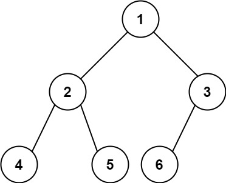

# 222 Count Complete Tree Nodes

- **Finished Date:** 2021-01-20
- **Tried:** 1
- **LeetCode Link:** [Count Complete Tree Nodes - LeetCode](https://leetcode.com/problems/count-complete-tree-nodes/)
- **Tags:** [`Binary Search`](https://leetcode.com/tag/binary-search/), [`Tree`](https://leetcode.com/tag/tree/)
- **Difficulty:** Medium
- **Pass Rate:** 48.8543%

[Go Version](../Go/222_Count_Complete_Tree_Nodes/main.go)

## Problem description

Given the `root` of a **complete** binary tree, return the number of the nodes in the tree.

According to [Wikipedia](http://en.wikipedia.org/wiki/Binary_tree#Types_of_binary_trees), every level, except possibly the last, is completely filled in a complete binary tree, and all nodes in the last level are as far left as possible. It can have between `1` and <code>2<sup>h</sup></code> nodes inclusive at the last level `h`.

**Follow up:** Traversing the tree to count the number of nodes in the tree is an easy solution but with O(n) complexity. Could you find a faster algorithm?

### Constraints

- The number of nodes in the tree is in the range [0, 5 * 10<sup>4</sup>].
- 0 <= `Node.val` <= 5 * 10<sup>4</sup>
- The tree is guaranteed to be **complete**.

## Examples

### Example 1



```
Input: root = [1,2,3,4,5,6]
Output: 6
```

### Example 2

```
Input: root = []
Output: 0
```

### Example 3

```
Input: root = [1]
Output: 1
```
